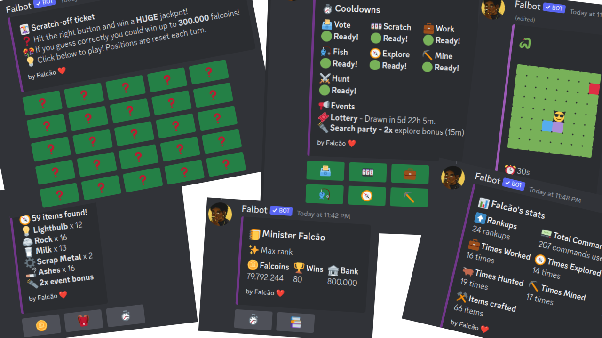

<h1 align="center"> Falbot 🪙 </h1>
<blockquote>

<i>
Falbot is a fun brazilian bot, with the focus point being enconomy, which includes a lot of other features and systems, such as tons of fun games, inventory, progression, competitive commands, and much more. 

Don’t miss the opportunity to have a unique and enriching experience on your Discord server with Falbot!
</i>

</blockquote>

    
    
    
    
    
    

## 🚀 Features

- 🎲 Tons of fun games
- ⚔️ Competitive commands
- 📈 Engaging rank-up and progression system
- 🏛️ Dynamic economy run by player activity
- 🎒 In-depth inventory and crafting system
- 👑 Global and local user leaderboards
- 🎉 Fun commands
- ⚙️ Useful commands
- 🌎 All features available in portuguese, english and spanish

Add him by clicking [here](https://discord.com/api/oauth2/authorize?client_id=742331813539872798&permissions=0&scope=bot%20applications.commands)

Support server: <https://discord.gg/8WrAtVYVKR>

Official website: <https://falbot.netlify.app/>

## 📷 Preview

## ❓ Want to contribute?

If you want to contribute, please read the [contributing guide](CONTRIBUTING.md).

## 🤝 Contributors

<!-- ALL-CONTRIBUTORS-LIST:START - Do not remove or modify this section -->
<!-- prettier-ignore-start -->
<!-- markdownlint-disable -->
<table>
  <tbody>
    <tr>
      <td align="center" valign="top" width="14.28%"><a href="https://falbot.netlify.app/"> <b>Falcão</b></a> <a href="#code-falcao-g" title="Code">💻</a> <a href="#doc-falcao-g" title="Documentation">📖</a> <a href="#bug-falcao-g" title="Bug reports">🐛</a> <a href="#translation-falcao-g" title="Translation">🌍</a></td>
      <td align="center" valign="top" width="14.28%"><a href="https://github.com/mateus-sposo"> <b>Mateus de Oliveira Sposo</b></a> <a href="#translation-mateus-sposo" title="Translation">🌍</a></td>
      <td align="center" valign="top" width="14.28%"><a href="https://github.com/Vinicius-Marques6"> <b>Vinícius Marques</b></a> <a href="#code-Vinicius-Marques6" title="Code">💻</a> <a href="#bug-Vinicius-Marques6" title="Bug reports">🐛</a></td>
      <td align="center" valign="top" width="14.28%"><a href="https://www.linkedin.com/in/tiago-amarilha-rodrigues-a7a6b31b8/"> <b>Tiago Amarilha Rodrigues</b></a> <a href="#doc-AmarilhaTiago" title="Documentation">📖</a></td>
      <td align="center" valign="top" width="14.28%"><a href="https://tacioss.dev"> <b>Tacio S. S.</b></a> <a href="#bug-taciossbr" title="Bug reports">🐛</a> <a href="#code-taciossbr" title="Code">💻</a></td>
      <td align="center" valign="top" width="14.28%"><a href="https://github.com/Piyush-Deshmukh"> <b>Piyush Deshmukh</b></a> <a href="#example-Piyush-Deshmukh" title="Examples">💡</a></td>
      <td align="center" valign="top" width="14.28%"><a href="https://github.com/Danilo-Mota"> <b>Danilo Mota</b></a> <a href="#doc-Danilo-Mota" title="Documentation">📖</a></td>
    </tr>
  </tbody>
</table>

<!-- markdownlint-restore -->
<!-- prettier-ignore-end -->

<!-- ALL-CONTRIBUTORS-LIST:END -->
# Falbot-promptAdvanced
